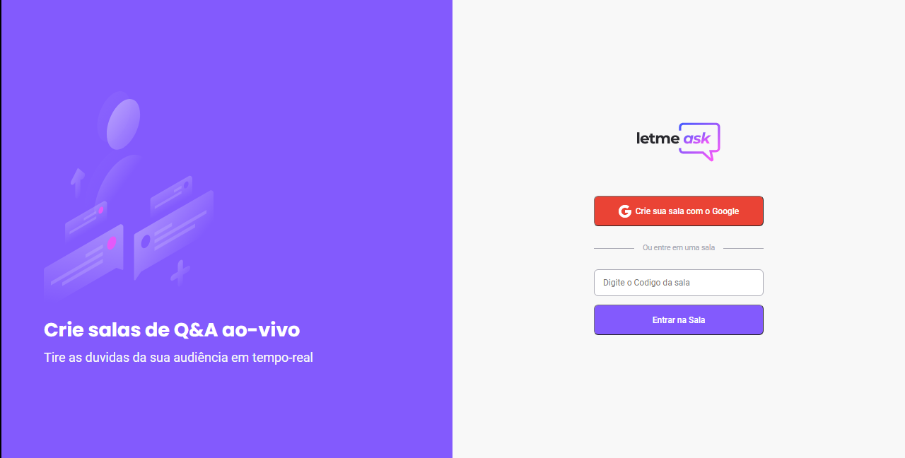
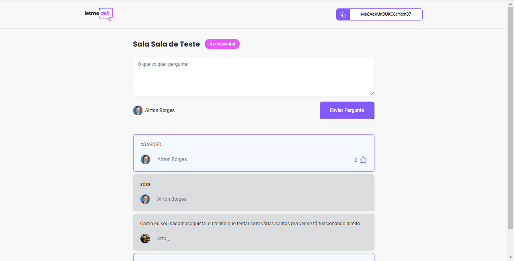
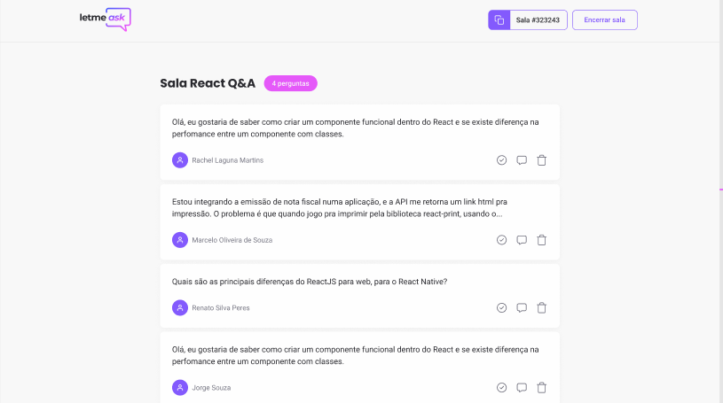

# Next Level Week: Front End Com React

> Um evento oferecido pela [RocketSeat](https://rocketseat.com.br/), focado em ensinar tecnologias recentes em Web.

> Quatro "caminhos" estavam disponíveis: Node.js, React Native, e React, que foi o que eu escolhi!

## LetMeAsk

—> [FIGMA](https://www.figma.com/file/u0BQK8rCf2KgzcukdRRCWh/Letmeask?node-id=0%3A1)

—> [SITE HOSTEADO NO VERCEL](https://nlw-front-end-react.vercel.app/)

—> [PAGINA NO NOTION COM INFORMAÇÕES QUE ACHEI RELEVANTES](https://freckle-phone-c56.notion.site/Next_Level_Week-React-b46a5375ba62419aa1fe093289c30b32)

---

> O evento consistia em criar uma aplicação do zero com React e Firebase, pra aprender na pratica.

> A ideia era criar um site para que um Streamer, ou pessoa que estivesse usando perguntas Ao Vivo, pudesse recebe-las em tempo real e de maneira organizada

- Existem duas views: A do Usuário, onde pessoas podem enviar perguntas, e curtir as perguntas que acharem mais interessantes

    

- E a visão do Admin, onde ele pode administrar a sala enquanto responde as perguntas, conseguindo marca-las como lidas, deixar uma pergunta em destaque e apagar as perguntas

    

## Minha experiência

> Quando me recomendaram participar desse evento, eu não imaginava o quanto eu ia acabar aprendendo. Eu já sabia o Básico de Web, HTML, CSS, e um pouco de JS, mas agora, eu sinto que tem um mundo novo aberto pra mim, e eu vou aproveitar ao máximo!